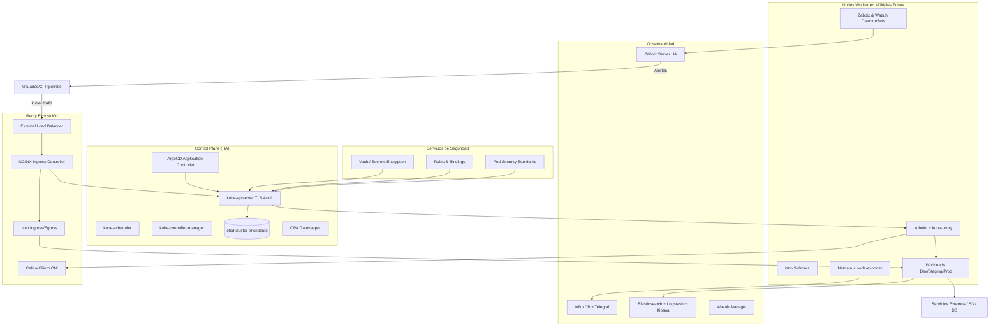
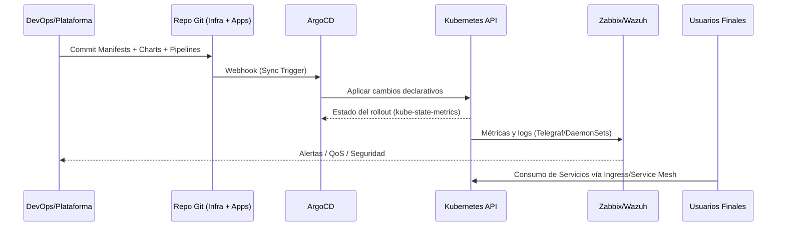

# Arquitectura Final de la Plataforma Kubernetes Empresarial

Este documento resume la arquitectura lógica y física resultante de la plataforma Kubernetes descrita en los manifiestos, charts y guías del repositorio. Se enfoca en los componentes críticos para alta disponibilidad, seguridad, observabilidad y automatización.

## 1. Vista General

- **Clúster HA multi-zona** con 3 nodos control plane y 3+ nodos worker distribuidos en al menos dos zonas de disponibilidad.
- **CNI de próxima generación (Calico/Cilium)** con eBPF para visibilidad y políticas de red estrictas.
- **Control de acceso Zero-Trust** mediante RBAC granular, OPA Gatekeeper y Pod Security Standards.
- **Capa de datos resiliente** con CSI drivers (AWS EBS / Longhorn) y StorageClasses replicadas para cargas con SLA.
- **Observabilidad 360°**: Zabbix + InfluxDB/Telegraf, Wazuh SIEM, ELK, Netdata, kube-state-metrics, node-exporter.
- **Automatización GitOps** con ArgoCD, pipelines declarativos y escalado automático (HPA + Cluster Autoscaler).

## 2. Diagrama Lógico de Componentes

## 3. Diagrama de Flujo de Despliegue (GitOps + CI/CD)

## 4. Distribución Física y Alta Disponibilidad

| Capa | Componentes | Características HA |
|------|-------------|--------------------|
| Control Plane | 3 nodos maestros (etcd, API Server, Scheduler, Controller Manager) | Multi-AZ, etcd cifrado, certificados rotados, PDB para componentes críticos |
| Nodo Worker | ≥3 nodos worker por entorno lógico (dev/staging/prod) | Autoescalado vertical/horizontal, taints/affinities para aislar cargas críticas |
| Red | Calico/Cilium + Istio + NGINX Ingress | Failover automático, balanceadores redundantes, TLS con Let's Encrypt |
| Datos | CSI Drivers (EBS/Longhorn), StorageClass replicada | Snapshot automático, políticas de retención, QoS para PVC |
| Observabilidad | Zabbix, Wazuh, ELK, InfluxDB | Despliegues HA (stateful sets), réplicas ≥2, backup remoto |
| Automatización | ArgoCD, Cluster Autoscaler, HPA | Reconciliación continua, escalado basado en métricas híbridas |

## 5. Segmentación por Namespace y Seguridad

- **Namespaces dedicados**: `platform-system`, `observability`, `security`, `dev`, `staging`, `prod`.
- **ResourceQuotas y LimitRanges** por namespace para evitar sobreasignación.
- **NetworkPolicies** que permiten únicamente tráfico necesario (ej. apps prod ↔ DB prod).
- **PodSecurity**: labels `pod-security.kubernetes.io/enforce=baseline` (dev) y `restricted` (staging/prod).
- **OPA Gatekeeper**: plantillas que rechazan pods privilegiados, hostPath, imágenes sin firma y namespaces sin etiquetas de cumplimiento.

## 6. Integraciones Clave

1. **Vault / Secrets Encryption**: sincronización mediante CSI Secret Store o External Secrets Operator para consumir secretos rotados.
2. **TLS Automatizado**: cert-manager emitiendo certificados Let's Encrypt Wildcard para Ingress y mTLS interno vía Istio.
3. **Auditoría y Cumplimiento**: logs del API Server a almacenamiento WORM, exportados a Wazuh/ELK para reportes PCI-DSS/GDPR.
4. **Escalabilidad**: HPA utiliza métricas de Zabbix/InfluxDB y métricas nativas; Cluster Autoscaler ajusta nodos según demanda.
5. **Resiliencia Operativa**: Pod Disruption Budgets, priorityClasses, backups programados (Velero/Restic opcional) y runbooks en `docs/`.

## 7. Referencias Cruzadas

- **Manifiestos base**: [`manifests/cluster-init.yaml`](../manifests/cluster-init.yaml)
- **Seguridad**: [`manifests/rbac-and-security.yaml`](../manifests/rbac-and-security.yaml)
- **Red e Ingress**: [`manifests/networking.yaml`](../manifests/networking.yaml)
- **Observabilidad**: [`manifests/monitoring-observability.yaml`](../manifests/monitoring-observability.yaml)
- **Automatización**: [`manifests/cicd-autoscaling.yaml`](../manifests/cicd-autoscaling.yaml)
- **Helm App de Referencia**: [`helm/microservice`](../helm/microservice)
- **Guía de Despliegue**: [`docs/deployment-guide.md`](./deployment-guide.md)

## 8. Próximos Pasos Sugeridos

1. Ejecutar pruebas de resiliencia (chaos engineering) para validar tolerancia a fallos de AZ.
2. Integrar escaneo de contenedores y firma (Notary/cosign) para fortalecer la cadena de suministro.
3. Configurar DR en sitio secundario con replicación de etcd y snapshots CSI.
4. Automatizar revisiones de cumplimiento periódicas con reportes exportables a auditores.

---

> **Nota**: Los diagramas en Mermaid pueden visualizarse directamente en GitLab/GitHub o renderizarse usando herramientas como `mmdc`. Asegúrese de versionar cualquier artefacto gráfico adicional (PNG/SVG) generado a partir de estos diagramas.
